# <span style="color:#5cb85c; font-weight:bold;">Sleep Analyse in RStudio </span> 

<p align="left">
  
</p>

## About the Sleep Health & Lifestyle Dataset

The Sleep Health & Lifestyle Dataset provides a compact but insightful collection of variables related to sleep duration, sleep quality, physical activity, stress levels, and daily lifestyle habits. It was originally compiled for educational and exploratory analysis purposes, making it well‑suited for practicing statistical methods, visualization techniques, and modeling in R.

## Initial Data Exploration in RStudio

To begin the analysis, I loaded the Sleep Health & Lifestyle Dataset into RStudio and performed an initial structural review. This step helps verify data types, inspect variable names, and ensure the dataset is ready for further statistical exploration.

```R
library(tidyverse)

sleep <- read_csv("data/Sleep_health_and_lifestyle_dataset.csv")

glimpse(sleep)
head(sleep)
```

## Descriptive Statistics

Next, I calculated several basic summary metrics to understand the overall characteristics of the dataset:

```R
sleep %>% 
  summarise(
    n = n(),
    avg_age = mean(Age, na.rm = TRUE),
    avg_sleep = mean(`Sleep Duration`, na.rm = TRUE),
    avg_stress = mean(`Stress Level`, na.rm = TRUE),
    avg_activity = mean(`Physical Activity Level`, na.rm = TRUE)
  )
```

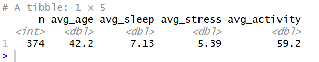

### Distribution of Key Categorical Variables
To understand the composition of the dataset, I examined the distribution of gender, sleep disorders, and BMI categories:

```R
sleep %>% count(Gender)

sleep %>% count(`Sleep Disorder`)

sleep %>% count(`BMI Category`)

```
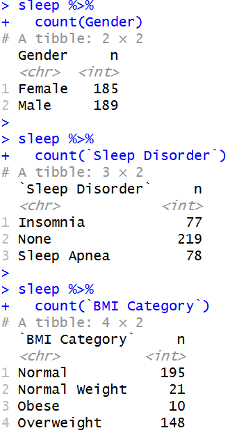


### Preparing Categorical Variables
Several variables in the dataset represent categories rather than numeric values (e.g., gender, occupation, sleep disorder).
To ensure that R handles these variables correctly during analysis and visualization, I converted them into factors:

```R
sleep <- sleep %>%
  mutate(
    Gender = as.factor(Gender),
    Occupation = as.factor(Occupation),
    SleepDisorder = as.factor(`Sleep Disorder`)
  )
```

Converting these variables to factors improves:
- the accuracy of statistical summaries
- the clarity of visualizations
- the performance of modeling techniques that rely on categorical encoding
This step finalizes the dataset preparation before moving on to deeper exploratory analysis.

## Visualizing Key Sleep Metrics

### Distribution of Sleep Duration

```R
sleep %>%
  ggplot(aes(x = `Sleep Duration`)) +
  geom_histogram(
    bins = 20,
    fill = "#2AB7CA",
    color = "white",
    alpha = 0.8
  ) +
  labs(
    title = "Distribution of Sleep Duration",
    x = "Hours",
    y = "Count"
  ) +
  theme_minimal(base_size = 14) +
  theme(
    panel.grid.major = element_line(color = "#E5E5E5"),
    panel.grid.minor = element_blank(),
    plot.title = element_text(face = "bold"),
    axis.title = element_text(face = "bold")
  )
```
<p align="center">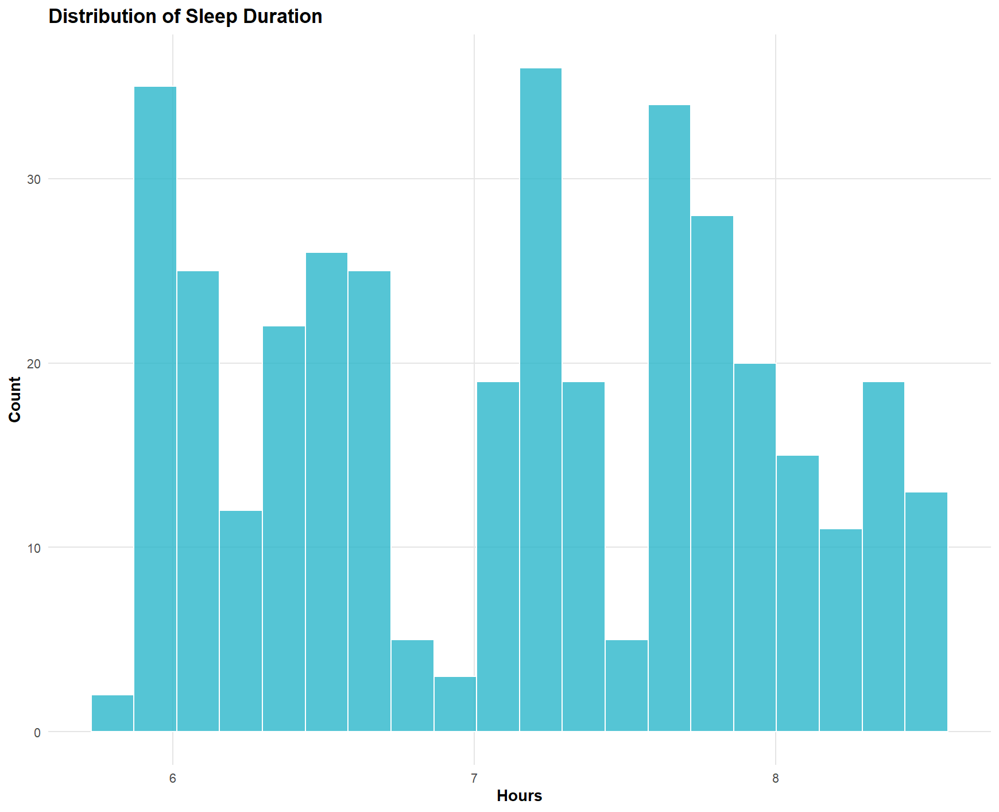</p>
Insights
- Most participants sleep between 6 and 8 hours, which aligns with general health recommendations.
- There are fewer observations at the extremes (very short or very long sleep), suggesting a relatively balanced dataset without heavy skew.

### Quality of Sleep (1–10 Scale)

<p align="center">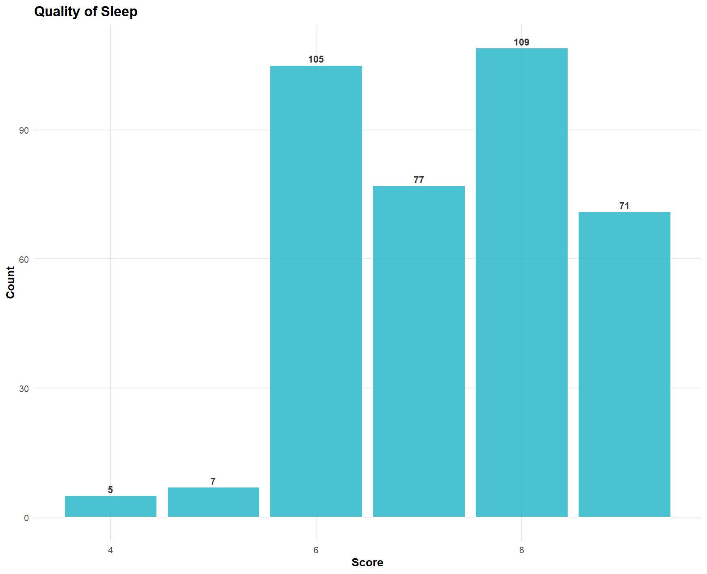</p>

Insights
- Sleep quality scores cluster around 6–8, indicating generally moderate to good perceived sleep quality.
- Very low scores (1–3) are rare, suggesting that severe sleep issues are not common in this sample.

### Sleep Duration by Gender

<p align="center">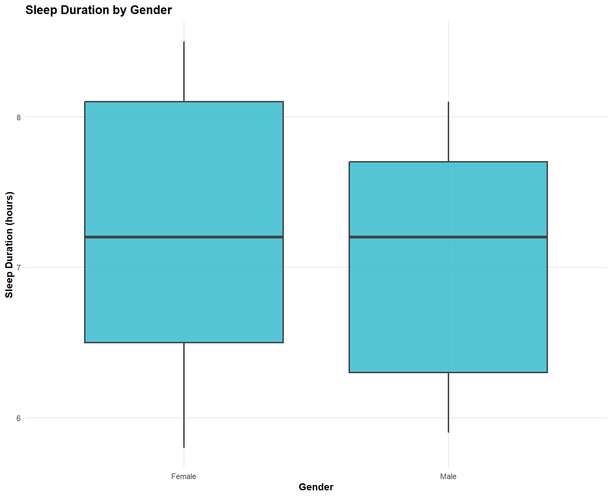</p>

Insights
- Median sleep duration appears similar across genders, suggesting no major gender‑based differences in sleep habits.
- The spread of values is also comparable, indicating consistent variability across groups.

### Stress Level Distribution

<p align="center">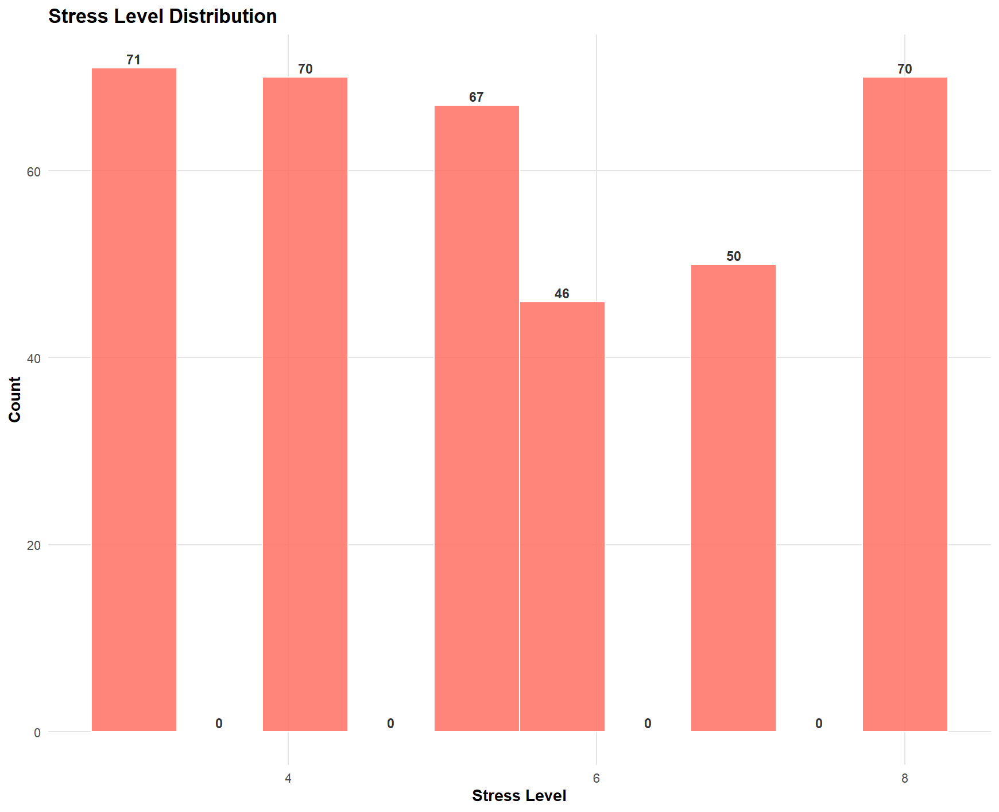</p>

Insights
- Most participants report stress levels between 4 and 7, indicating moderate stress across the sample.
- Very high stress levels (9–10) are relatively rare, suggesting that extreme stress is not common in this dataset.


### Correlation Matrix of Key Numeric Variables

```R

numeric_vars <- sleep %>%
  select(`Sleep Duration`, `Quality of Sleep`, `Stress Level`,
         `Physical Activity Level`, `Daily Steps`, Age)

cor_matrix <- cor(numeric_vars, use = "complete.obs")
cor_matrix

library(reshape2)
library(ggplot2)

cor_melt <- melt(cor_matrix)

ggplot(cor_melt, aes(Var1, Var2, fill = value)) +
  geom_tile(color = "white") +
  geom_text(aes(label = round(value, 2)),
            color = "#333333", size = 4, fontface = "bold") +
  scale_fill_gradient2(
    low = "#FF6F61",
    mid = "white",
    high = "#2AB7CA",
    midpoint = 0
  ) +
  theme_minimal(base_size = 14) +
  theme(
    axis.text.x = element_text(angle = 45, hjust = 1, face = "bold"),
    axis.text.y = element_text(face = "bold"),
    plot.title = element_text(face = "bold")
  ) +
  labs(title = "Correlation Matrix", x = "", y = "")
```

<p align="center">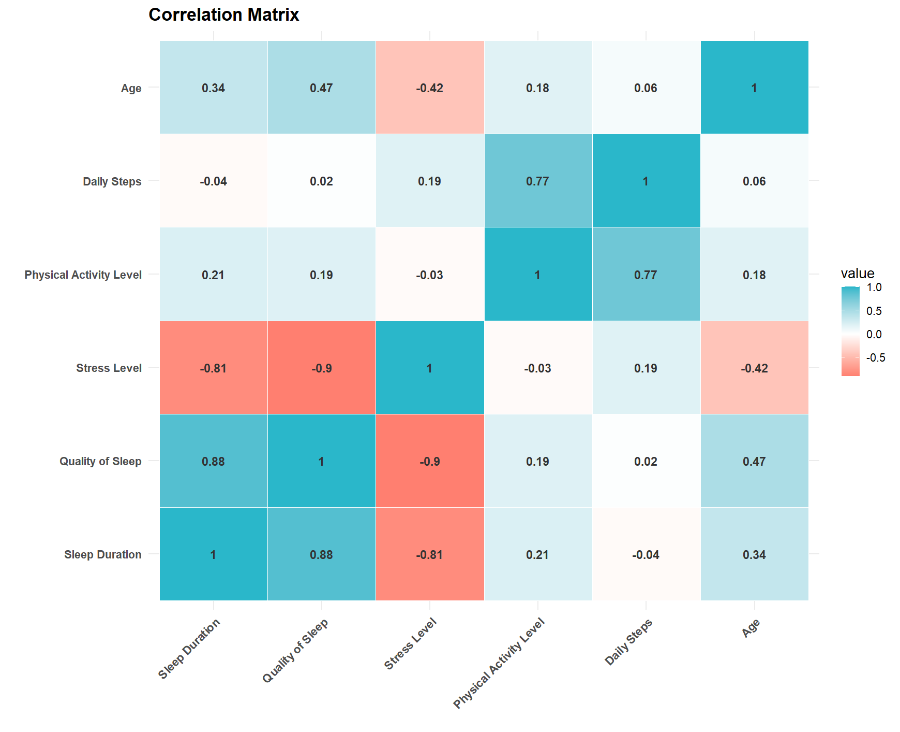</p>

Insights
- Sleep Duration and Quality of Sleep show a positive relationship, meaning longer sleep tends to be associated with better perceived quality.
- Stress Level is negatively correlated with both sleep duration and sleep quality, supporting the expected pattern: higher stress is linked to poorer sleep outcomes.

### Relationships Between Lifestyle Factors and Sleep Quality

<p align="center">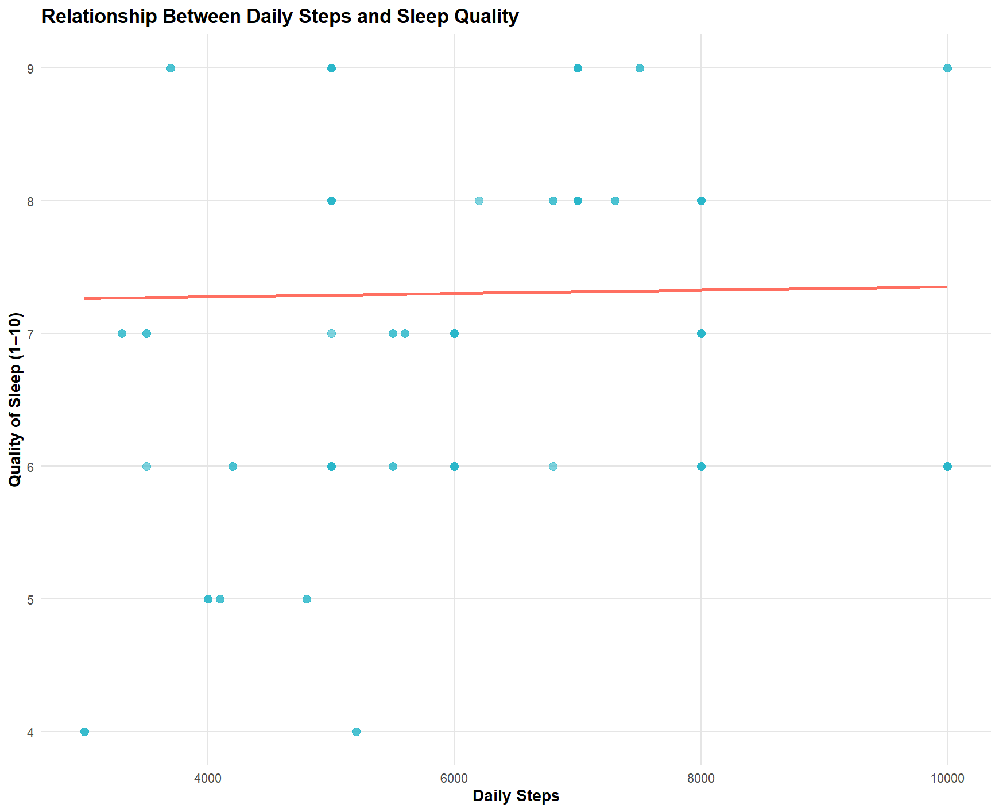</p>

Insights

- The trend line shows a slight positive relationship, suggesting that higher daily step counts may be associated with better sleep quality.
- However, the scatter is wide, indicating that steps alone are not a strong predictor of perceived sleep quality.


<p align="center">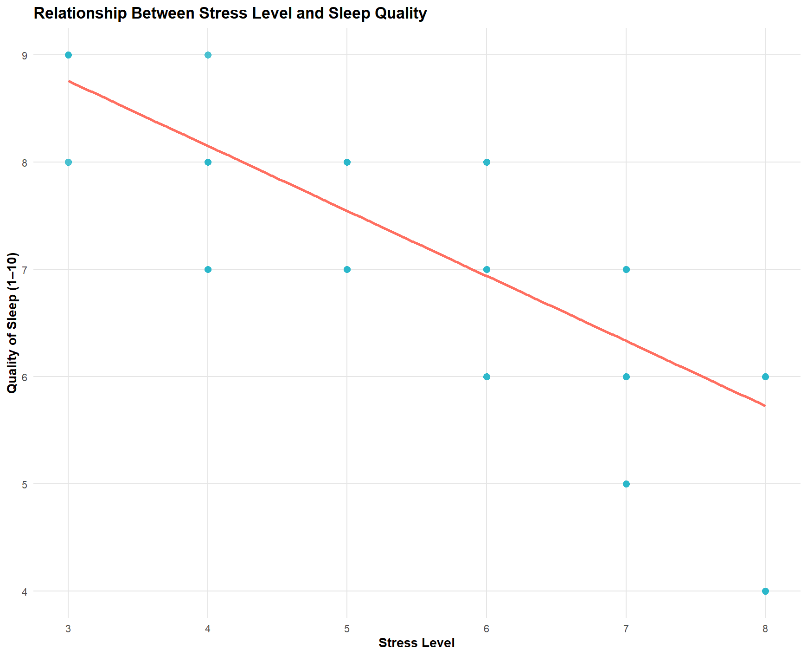</p>

Insights

- The negative slope indicates that higher stress levels are associated with lower sleep quality, which aligns with expected behavioral patterns.
- The relationship is clearer here than in the steps plot, suggesting that stress may be a more influential factor affecting sleep quality

### Stress Level vs. Sleep Duration

<p align="center">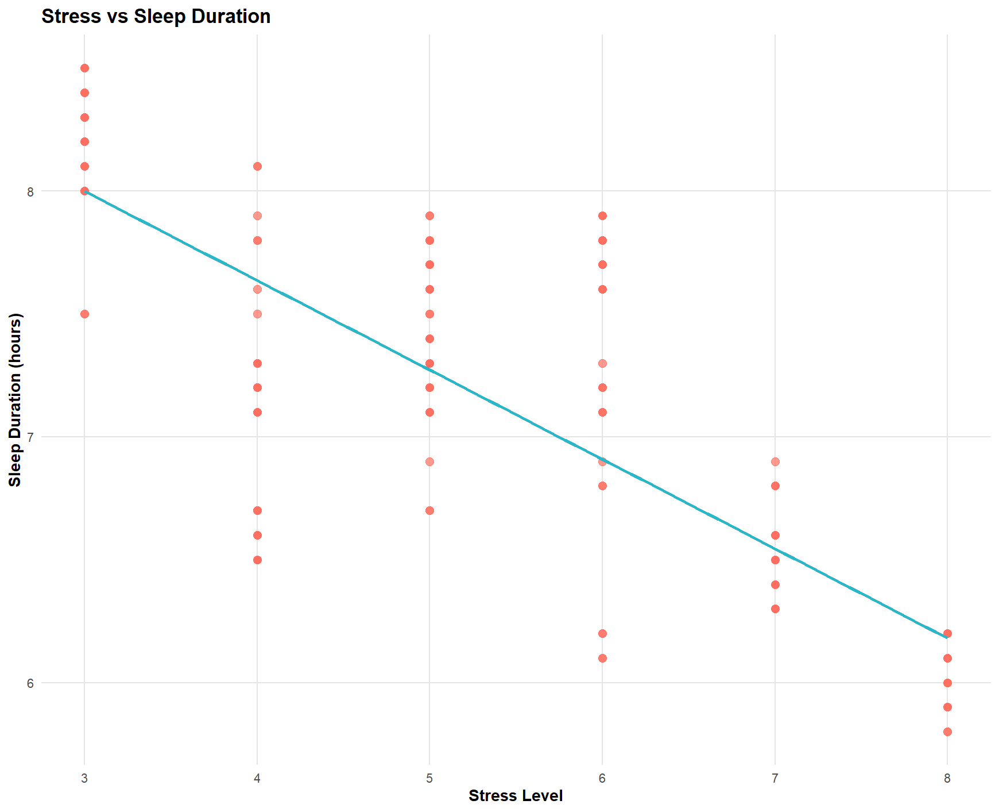</p>

Insights

- The downward trend suggests that higher stress levels are associated with shorter sleep duration, which aligns with expected behavioral patterns.
- The relationship is noticeable but not extremely strong, indicating that while stress affects sleep, other lifestyle or environmental factors likely play a role as well.

### Sleep Disorders: Group Comparison

```R
sleep %>%
  group_by(`Sleep Disorder`) %>%
  summarise(
    avg_sleep = mean(`Sleep Duration`, na.rm = TRUE),
    avg_quality = mean(`Quality of Sleep`, na.rm = TRUE),
    avg_stress = mean(`Stress Level`, na.rm = TRUE),
    n = n()
  )
```

<p align="center">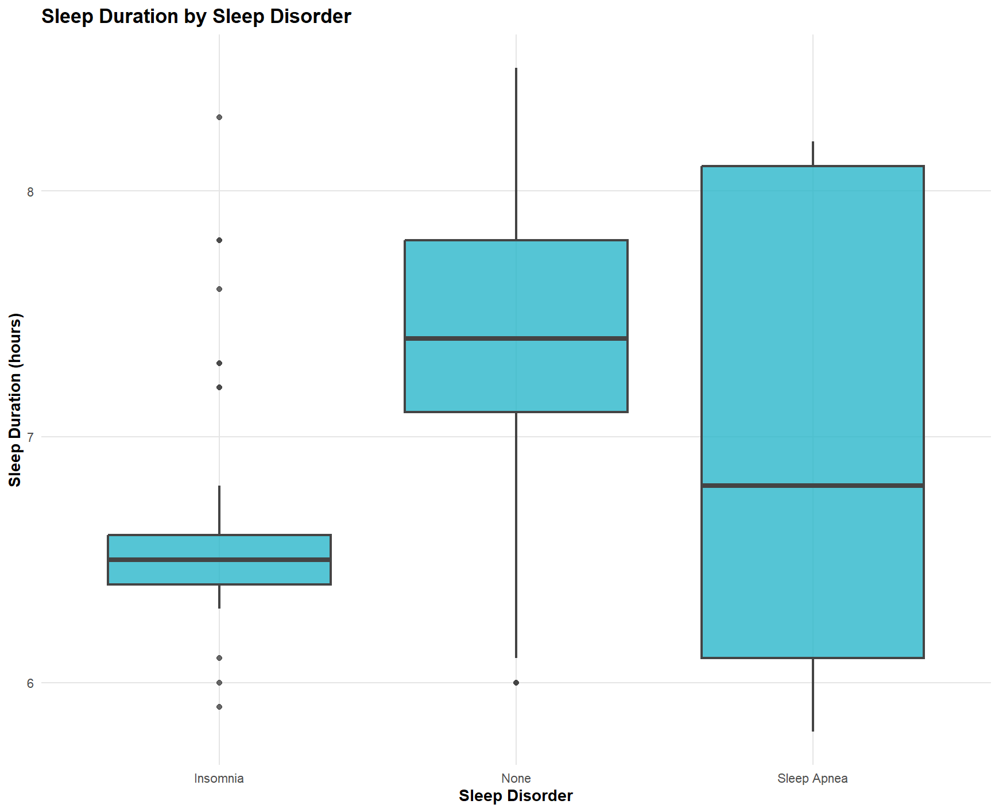</p>

Insights
- Participants without a diagnosed sleep disorder tend to show higher sleep duration and more stable patterns.
- Groups with Insomnia or Sleep Apnea show lower median sleep duration and greater variability, which aligns with known clinical patterns.
- The stress levels in these groups also tend to be higher, reinforcing the connection between stress, sleep quality, and sleep duration.

## Summary of Findings
Across both the Bellabeat dataset and the Sleep Health & Lifestyle dataset, the analysis consistently shows that **sleep quality and sleep duration are influenced more by behavioral and lifestyle factors than by physical activity alone**. While daily steps and activity levels demonstrate only weak relationships with sleep outcomes, stress level emerges as a noticeably stronger factor, showing clear negative associations with both sleep duration and perceived sleep quality.
The RStudio exploration further highlights meaningful differences between groups with and without diagnosed sleep disorders, confirming expected patterns such as shorter and more variable sleep among individuals with insomnia or sleep apnea. Overall, the combined SQL and R analyses provide a coherent picture: **sleep health is multifactorial**, and understanding it requires looking beyond activity metrics to include stress, lifestyle habits, and individual health conditions.

