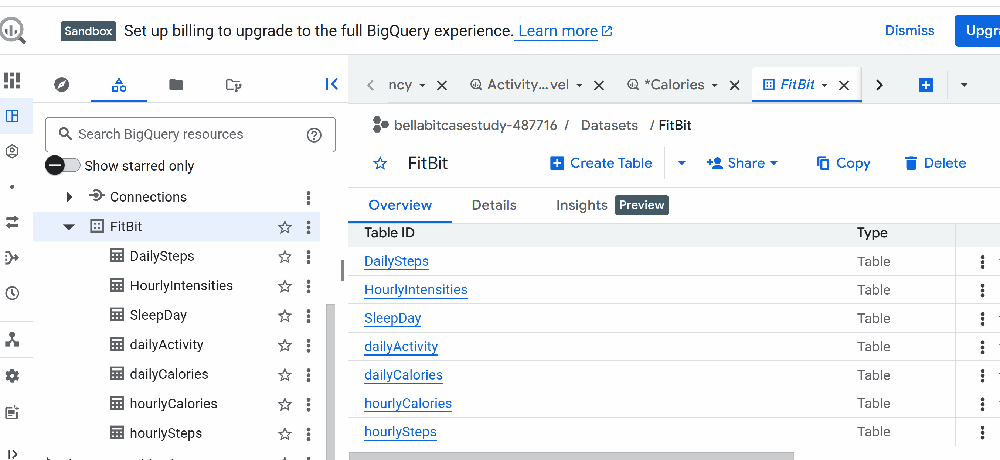
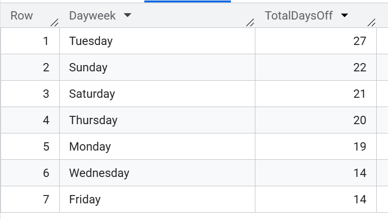
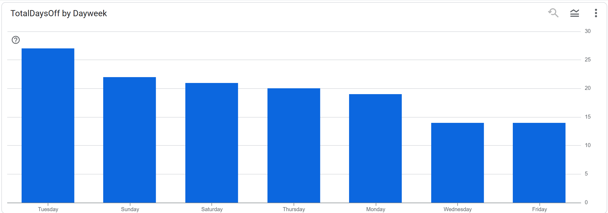
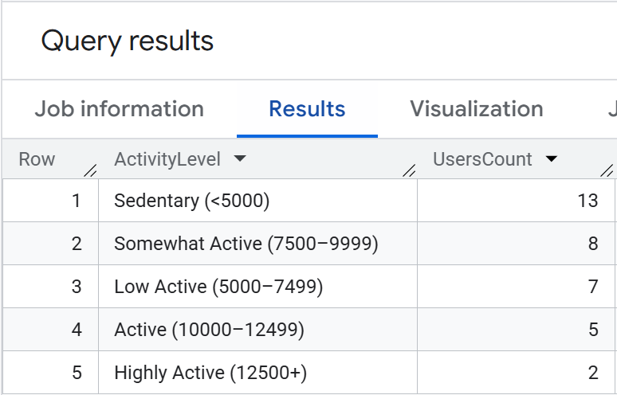
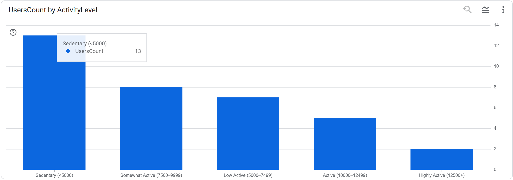
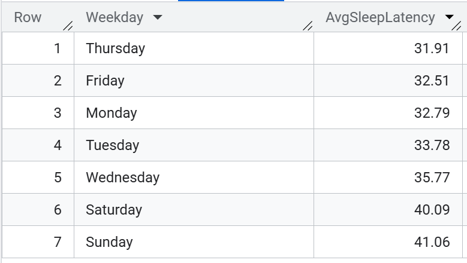

# <span style="color:#5cb85c; font-weight:bold;">ANALYZE WITH BIGQUERY</span>
<p align="left">
  
</p>

After preparing the cleaned datasets, I created corresponding tables in **Google BigQuery** by uploading all resulting CSV files. This allowed me to run SQL queries efficiently, perform aggregations, and explore user activity patterns at scale.


<p align="center">
  
</p>

After uploading all prepared CSV files into BigQuery, I performed an initial structural check of the dataset.  
Using a simple query:

```sql
SELECT  
  COUNT(DISTINCT Id)
FROM `TABLENAME`;
```
I confirmed that the dataset contains activity records from **35** unique users.
However, the SleepDay table includes data for only **25** users, indicating incomplete sleep tracking coverage and reinforcing the need for an additional data source.


## Identifying Days with Zero Activity

To better understand user engagement and device usage patterns, I examined all records in the dailyActivity table where every distance and step metric equals zero. Such entries typically indicate that the device was not worn, not synced, or simply out of battery.

[**SQL/queries**](queries/Dayweek.sql)

### Summary of Findings

The aggregated results show:

| Total Records | Off Records | Percentage Off |
|---------------|-------------|----------------|
| **1397**      | **137**     | **9.81%**      |

Nearly **10% of all daily records** contain zero activity across all metrics.  
This strongly suggests that the device was **not used**, **not worn**, or **out of battery** on those days.

### Visualizing the Results
One of the advantages of working with BigQuery in combination with visualization tools is the ability to instantly transform query outputs into clear visual summaries. Below are two complementary charts that illustrate the distribution of “days off”:

<div style="display: flex; gap: 20px;"></div>

The first image shows the raw counts of zero‑activity days per user, while the second highlights how these inactive days are distributed across the week. Together, they provide a quick and intuitive understanding of when and how often the device was not used.

## Daily Step Analisys
Understanding daily step counts is essential for evaluating overall activity levels and identifying behavioral patterns among users. To contextualize the results, I used the widely referenced step‑based activity classification proposed by Tudor‑Locke et al. in the article
**“How many steps/day are enough?” (2004)**
https://pubmed.ncbi.nlm.nih.gov/14715035/

This framework provides evidence‑based thresholds for categorizing physical activity levels based on average daily steps.


### Classifying Users by Activity Level

Using the Tudor‑Locke step‑based categories, I calculated the average daily steps per user and assigned each user to an activity level:

```sql
WITH per_user AS (
  SELECT
    Id,
    AVG(TotalSteps) AS AvgSteps
  FROM `bellabitcasestudy-487716.FitBit.dailyActivity`
  GROUP BY Id
)
SELECT
  CASE
    WHEN AvgSteps < 5000 THEN 'Sedentary (<5000)'
    WHEN AvgSteps BETWEEN 5000 AND 7499 THEN 'Low Active (5000–7499)'
    WHEN AvgSteps BETWEEN 7500 AND 9999 THEN 'Somewhat Active (7500–9999)'
    WHEN AvgSteps BETWEEN 10000 AND 12499 THEN 'Active (10000–12499)'
    ELSE 'Highly Active (12500+)'
  END AS ActivityLevel,
  COUNT(*) AS UsersCount
FROM per_user
GROUP BY ActivityLevel
ORDER BY UsersCount DESC;
```
To better understand how users are distributed across activity categories, I visualized the results of the step‑based classification. The charts below summarize both the numeric output and the proportional distribution of users across activity levels.

<div style="display: flex; gap: 20px;"></div>

### Interpretation
The distribution reveals several important insights:
- The largest group (13 users) falls into the Sedentary (<5000 steps/day) category.
This suggests that a significant portion of users are not meeting even minimal activity thresholds.
- The next largest groups are Somewhat Active (8 users) and Low Active (7 users).
Together, these categories represent moderate but inconsistent activity patterns.
- Only 5 users reach the Active (10,000–12,499 steps/day) level, which aligns with general health recommendations.
- Just 2 users qualify as Highly Active (12,500+ steps/day), indicating that very high activity levels are rare in this dataset.

What This Means for Bellabeat

- The majority of users fall below recommended daily activity levels, highlighting an opportunity for behavioral nudges, reminders, or gamified challenges.
- The clear skew toward sedentary behavior suggests that engagement strategies could significantly improve user outcomes.
- These insights also help identify potential target segments for personalized recommendations.


## Sleep Analisys

Sleep quality is a crucial component of overall well‑being, and understanding how users sleep can help identify behavioral patterns, device usage habits, and potential areas for improvement.
In this section, I focus on sleep latency — the time between going to bed and actually falling asleep — and explore whether it correlates with daily activity levels.

To calculate average sleep latency for each weekday, I used the following query:

```sql
SELECT
  Weekday,
  ROUND(AVG(TotalTimeInBed - TotalMinutesAsleep),2) AS AvgSleepLatency
FROM `bellabitcasestudy-487716.FitBit.SleepDay`
GROUP BY Weekday
ORDER BY AvgSleepLatency;
```

<div style="display: flex; gap: 20px;"></div>


Interpretation
- Weekends show the longest sleep latency — especially Sunday (41 min) and Saturday (40 min).
This may reflect irregular routines, later bedtimes, or increased screen time.
- Weekdays have shorter latency, with Thursday being the lowest (31.9 min).
This suggests more structured daily schedules and more predictable sleep patterns.
- The difference between the shortest and longest latency is nearly 10 minutes, which is meaningful for understanding user habits.

### Exploring Correlation Between Activity and Sleep Latency

To test whether physical activity influences how quickly users fall asleep, I calculated correlations between sleep latency and three activity metrics:
- Total steps
- Very active minutes
- Calories burned

```sql
SELECT
  CORR(a.TotalSteps, (s.TotalTimeInBed - s.TotalMinutesAsleep)) AS corr_steps_latency,
  CORR(a.VeryActiveMinutes, (s.TotalTimeInBed - s.TotalMinutesAsleep)) AS corr_active_latency,
  CORR(a.Calories, (s.TotalTimeInBed - s.TotalMinutesAsleep)) AS corr_calories_latency
FROM `bellabitcasestudy-487716.FitBit.dailyActivity` a
JOIN `bellabitcasestudy-487716.FitBit.SleepDay` s
  ON a.Id = s.Id AND a.ActivityDate = s.SleepDay;
  ```
- corr_steps_latency	- 0.02 
- corr_active_latency	- (-0.09 )
- corr_calories_latency - (-0.27)

Interpretation
- No meaningful correlation was found between activity and sleep latency.
- The strongest value (calories: –0.266) is still too weak to indicate a reliable relationship.
- The dataset is relatively small and contains limited overlapping days between activity and sleep records, which reduces the statistical power needed to detect correlations.
- This suggests that users’ sleep latency is influenced more by behavioral or lifestyle factors (screen time, stress, bedtime routines) than by physical activity.
- A more detailed and statistically robust sleep analysis was conducted using a richer dataset. The Sleep Health & Lifestyle Dataset was analyzed separately in RStudio (version 2026.01.0), using R for statistical exploration, visualization, and modeling.
The full analysis can be found here: [**R**](R)


## Additional Analyses
To keep the main report focused and readable, more granular explorations were placed in the SQL folder.
You can find:
- Hourly Activity Analysis — detailed patterns of steps, intensity, and device usage across the day
→ [**Hourly Activity Analysis**](queries/HourlyAnalysis.sql)
- Calories Analysis — deeper investigation of energy expenditure and its relationship to activity metrics
→ [**Calories Analysis**](Calories.sql)

These files contain extended queries and insights that complement the findings presented in this section.

